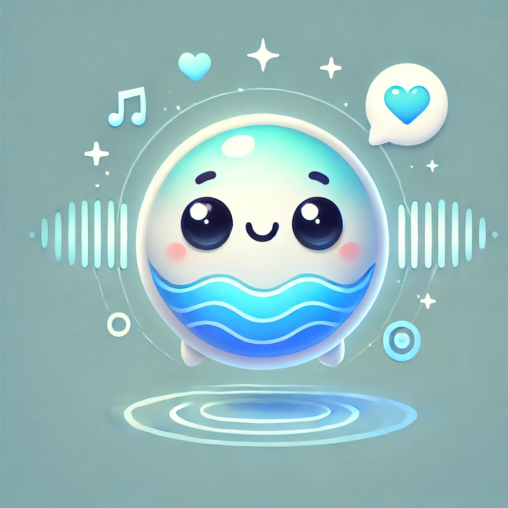

<!--
Hey, thanks for using the awesome-readme-template template.
If you have any enhancements, then fork this project and create a pull request
or just open an issue with the label "enhancement".

Don't forget to give this project a star for additional support ;)
Maybe you can mention me or this repo in the acknowledgements too
-->
<div align="center">

  <!--  -->
  <h1>DurFlex-EVC: Duration-Flexible Emotional Voice Conversion with Parallel Generation (Under review)</h1>
  
  <p>

  </p>
  
  
<!-- Badges -->
<p>
  <a href="https://github.com/hs-oh-prml/DurFlexEVC/graphs/contributors">
    
  </a>
  <a href="">
    
  </a>
  <a href="https://github.com/hs-oh-prml/DurFlexEVC/network/members">
    
  </a>
  <a href="https://github.com/hs-oh-prml/DurFlexEVC/stargazers">
    
  </a>
  <!-- <a href="https://github.com/hs-oh-prml/DurFlexEVC/issues/">
     -->
  </a>
  <!-- <a href="https://github.com/hs-oh-prml/DurFlexEVC/blob/master/LICENSE">
    
  </a> -->
</p>
   
<!-- <h4>
    <a href="https://github.com/hs-oh-prml/DurFlexEVC/">View Demo</a>
  <span> · </span>
    <a href="https://github.com/hs-oh-prml/DurFlexEVC">Documentation</a>
  <span> · </span>
    <a href="https://github.com/hs-oh-prml/DurFlexEVC/issues/">Report Bug</a>
  <span> · </span>
    <a href="https://github.com/hs-oh-prml/DurFlexEVC/issues/">Request Feature</a>
  </h4> -->
</div>

<br />

<!-- Table of Contents -->

<!-- # Table of Contents

- [About the Project](#about-the-project)
  - [Architecture](#Architecture)
  - [Tech Stack](#tech-stack)
  - [Features](#features)
  - [Color Reference](#color-reference)
  - [Environment Variables](#environment-variables)
- [Getting Started](#getting-started)
  - [Prerequisites](#prerequisites)
  - [Installation](#installation)
  - [Running Tests](#running-tests)
  - [Run Locally](#run-locally)
  - [Deployment](#deployment)
- [Usage](#usage)
- [Roadmap](#roadmap)
- [Contributing](#contributing)
  - [Code of Conduct](#code-of-conduct)
- [FAQ](#faq)
- [License](#license)
- [Contact](#contact)
- [Acknowledgements](#acknowledgements) -->

<!-- About the Project -->

## About the Project

Emotional voice conversion (EVC) seeks to modify the emotional tone of a speaker’s voice while preserving the original linguistic content and the speaker’s unique vocal characteristics.
Recent advancements in EVC have involved the simultaneous modeling of pitch and duration, utilizing the potential of sequence-to-sequence (seq2seq) models.
To enhance reliability and efficiency in conversion, this study shifts focus towards parallel speech generation.
We introduce Duration-Flexible EVC (DurFlex-EVC), which integrates a style autoencoder and unit aligner.
Traditional models, while incorporating self-supervised learning (SSL) representations that contain both linguistic and paralinguistic information, have neglected this dual nature, leading to reduced controllability.
Addressing this issue, we implement cross-attention to synchronize these representations with various emotions.
Additionally, a style autoencoder is developed for the disentanglement and manipulation of style elements.
The efficacy of our approach is validated through both subjective and objective evaluations, establishing its superiority over existing models in the field.

<!-- Screenshots -->

### Architecture

<div align="center"> 
  
</div>

<!-- TechStack -->

### Tech Stack

<details>
  <summary>Framework</summary>
  <ul>
    <li><a href="https://www.python.org/">Python</a></li>
    <li><a href="https://pytorch.org/">PyTorch</a></li>
    <li><a href="https://huggingface.co/">HuggingFace</a></li>
    <!-- <li><a href="https://reactjs.org/">React.js</a></li>
    <li><a href="https://tailwindcss.com/">TailwindCSS</a></li> -->
  </ul>
</details>

<!-- <details>
  <summary>Server</summary>
  <ul>
    <li><a href="https://www.typescriptlang.org/">Typescript</a></li>
    <li><a href="https://expressjs.com/">Express.js</a></li>
    <li><a href="https://go.dev/">Golang</a></li>
    <li><a href="https://nestjs.com/">Nest.js</a></li>
    <li><a href="https://socket.io/">SocketIO</a></li>
    <li><a href="https://www.prisma.io/">Prisma</a></li>
    <li><a href="https://www.apollographql.com/">Apollo</a></li>
    <li><a href="https://graphql.org/">GraphQL</a></li>
  </ul>
</details> -->

<!-- <details>
<summary>Database</summary>
  <ul>
    <li><a href="https://www.mysql.com/">MySQL</a></li>
    <li><a href="https://www.postgresql.org/">PostgreSQL</a></li>
    <li><a href="https://redis.io/">Redis</a></li>
    <li><a href="https://neo4j.com/">Neo4j</a></li>
    <li><a href="https://www.mongodb.com/">MongoDB</a></li>
  </ul>
</details> -->

<!-- <details>
<summary>DevOps</summary>
  <ul>
    <li><a href="https://www.docker.com/">Docker</a></li>
    <li><a href="https://www.jenkins.io/">Jenkins</a></li>
    <li><a href="https://circleci.com/">CircleCLI</a></li>
  </ul>
</details> -->

<!-- Features -->

<!-- ### Features

- Feature 1
- Feature 2
- Feature 3 -->

<!-- Color Reference -->

<!-- ### Color Reference

| Color           | Hex                                                              |
| --------------- | ---------------------------------------------------------------- |
| Primary Color   |  #222831 |
| Secondary Color |  #393E46 |
| Accent Color    |  #00ADB5 |
| Text Color      |  #EEEEEE | -->

<!-- Env Variables -->

<!-- ### Environment Variables

To run this project, you will need to add the following environment variables to your .env file

`API_KEY`

`ANOTHER_API_KEY` -->

<!-- Getting Started -->

## Getting Started

<!-- Prerequisites -->

### Prerequisites

```bash
 pip install -r requirements.txt
```

### Training

TBA

<!-- Installation -->

<!-- ### Installation

Install my-project with npm

```bash
  yarn install my-project
  cd my-project
``` -->

<!-- Running Tests -->

<!-- ### Running Tests

To run tests, run the following command

```bash
  yarn test test
``` -->

<!-- Run Locally -->

<!-- ### Run Locally

Clone the project

```bash
  git clone https://github.com/Louis3797/awesome-readme-template.git
```

Go to the project directory

```bash
  cd my-project
```

Install dependencies

```bash
  yarn install
```

Start the server

```bash
  yarn start
``` -->

<!-- Deployment -->

<!-- ### Deployment

To deploy this project run

```bash
  yarn deploy
``` -->

<!-- Usage -->

<!-- ## Usage

Use this space to tell a little more about your project and how it can be used. Show additional screenshots, code samples, demos or link to other resources.

```javascript
import Component from "my-project";

function App() {
  return <Component />;
}
``` -->

<!-- Roadmap -->

<!-- ## Roadmap

- [x] Todo 1
- [ ] Todo 2 -->

<!-- Contributing -->

<!-- ## Contributing

<a href="https://github.com/Louis3797/awesome-readme-template/graphs/contributors">
  
</a> -->

<!-- Contributions are always welcome! -->

<!-- See `contributing.md` for ways to get started. -->

<!-- Code of Conduct -->

<!-- ### Code of Conduct

Please read the [Code of Conduct](https://github.com/Louis3797/awesome-readme-template/blob/master/CODE_OF_CONDUCT.md) -->

<!-- FAQ -->

<!-- ## FAQ

- Question 1

  - Answer 1

- Question 2

  - Answer 2 -->

<!-- License -->

<!-- ## License

Distributed under the no License. See LICENSE.txt for more information. -->

<!-- Contact -->

<!-- ## Contact

Your Name - [@twitter_handle](https://twitter.com/twitter_handle) - email@email_client.com

Project Link: [https://github.com/Louis3797/awesome-readme-template](https://github.com/Louis3797/awesome-readme-template) -->

<!-- Acknowledgments -->

## Acknowledgements

- [NATSpeech](https://github.com/NATSpeech/NATSpeech)
- [UnitSpeech](https://github.com/gmltmd789/UnitSpeech)
- [BigVGAN](https://github.com/NVIDIA/BigVGAN)
- [HuBERT](https://github.com/facebookresearch/fairseq/blob/main/examples/hubert/README.md)
